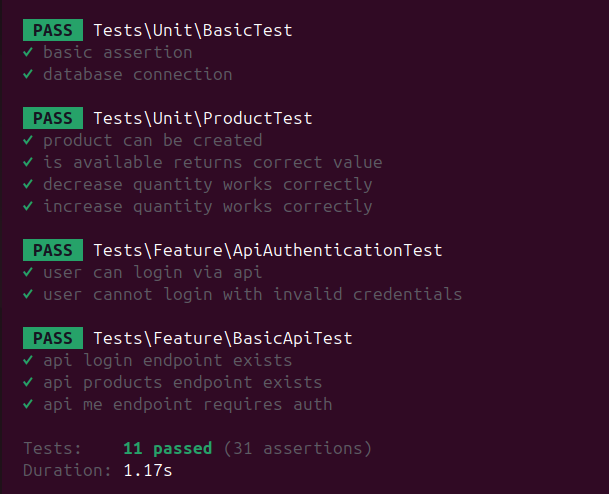

# Vending Maching

## Requirements
- PHP v8.3^
- Node v24.0^

## Configuration
- copy `.env.example` to `.env`
- configuration on `.env` file

## Install requiremens (Manual)
- `composer install`
- `npm install` 
- `npm run build`
- `php artisan migrate --seed`
- `php artisan optimize`
- `php artisan storage:link`

### With Docker conversion
- `docker-compose exec app php artisan migrate --seed`
- `docker-compose exec app php artisan optimize`
- `docker-compose exec app php artisan storage:link`

### Access Panel:

#### Admin Account
-   Url: `http://locahost:8000/login`
-   Email: `admin@localhost.com`
-   Password: `@dmin123`
#### User Account
-   Url: `http://locahost:8000/login`
-   Email: `user@localhost.com`
-   Password: `password`

## API Documentation
- API Documentation: [Click Here](./docs/API_README.md)
- Postman Exported File : [Click Here](./docs/Vending_Machine.postman_collection.json), 
After Download postman collection file and import it to your postman to test the API.
```
Configuration need to update
{{baseurl}} - Base URL (http://localhost:8000/)
{{version}} - API Version (v1)
```

## Test Result

```
php artisan test
(or with docker conversion)
docker-compose exec -u root app php artisan test
```


# Git Best Practices

As per our development workflow, always work on the 'dev' branch by default. Ensure you check out the 'dev' branch before making any code changes or initiating new feature development. Strict adherence to this practice is crucial for maintaining a clean codebase and minimizing conflicts.

## Important

Kindly create a pull request for code review before merging your changes into the 'dev' branch. This practice promotes collaboration and ensures code quality.

## Commit Messages

-   For commit messages, always start with:
    -   `feat: <message>` if it's a new feature
    -   `fix: <message>` if it's a bug fix
    -   `hotfix: <message>` if it's a hotfix
    -   `refactor: <message>` if it's a refactoring
-   Use imperative present tense in commit messages, e.g., "Add user authentication"
-   Capitalize the commit message subject line
-   Limit the subject line to 50 characters
-   Separate subject from body with a blank line
-   Use the commit body to explain "what", "why" and "how" you did

## Branch Naming

-   refactor/<some-ID-to-implement-in-future> <<< refactor
-   fix/<some-ID-to-implement-in-future> <<< fix
-   hotfix/<some-ID-to-implement-in-future> <<< hotfix
-   feat/<some-ID-to-implement-in-future> <<< new feature

For now, just put a short and concise branch name such as:

-   feat/user-menu
-   fix/user-logout-issue
-   refactor/menu-removal

## Additional Best Practices

-   Always set the target branch to _dev_
-   Submit for PR to review before merging into the target branch, all members are welcome to review
-   Use a branching strategy like Git Flow
-   Squash/rebase commits before merging to _dev_
-   Write clear pull request descriptions
-   Enforce code reviews
-   Maintain consistent code style and formatting
-   Commit to feature branches, not directly to _dev_

## Developer Info
- Name: `Aung Kyaw Htwe (Austin)`
- Email: `dev.aungkyawhtwe@gmail.com`
